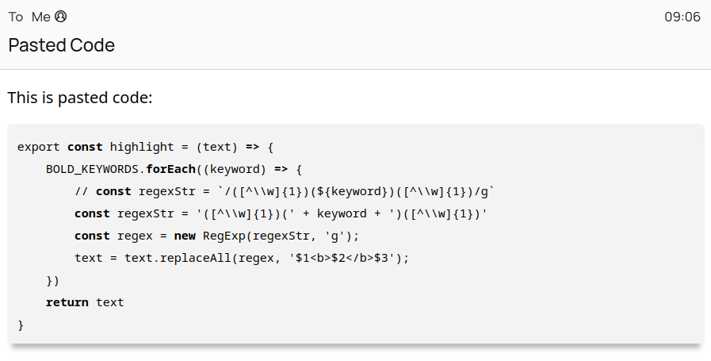

# Thunderbird addon creating a context menu option that pastes code beautifully in HTML messages

This addon adds a context menu option named <kbd>Paste Code</kbd>, which pastes the content of your clipboard formatted as code into your message.

## Limitations

* Currently, there is a manual maintained list of keywords which are formatted bold automatically
* The code is appended to the mail message, not inserted where your cursor is

## Installation

* Run `bundle.sh`, which will create the `xpi` file, and [install it in your Thunderbird profile](https://support.mozilla.org/en-US/kb/installing-addon-thunderbird).

## Motivation

There is already a way to format code as pre-formatted and monospace, option <kbd>Preformat</kbd> in the paragraph format select box. But there is no way to set a different background to separate it more from the normal text, and long lines do not break automatically.
